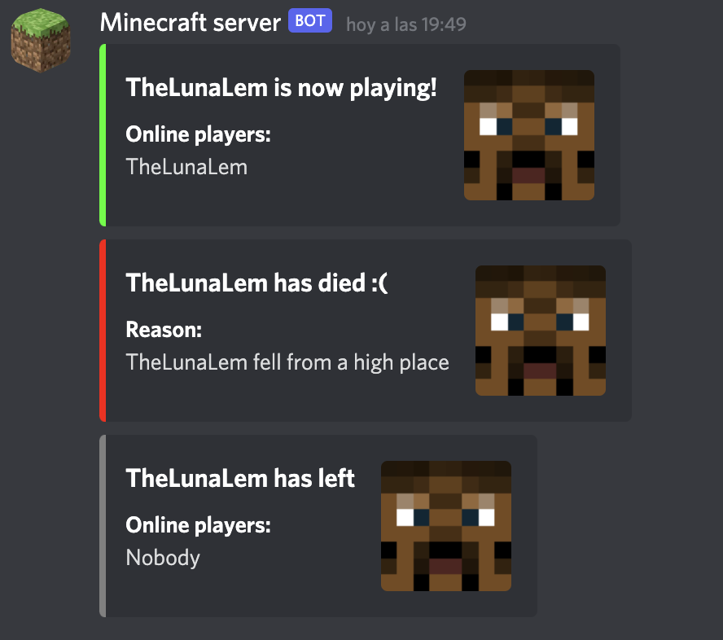

# PlayerEventsDiscord

**PlayerEventsDiscord** is a PaperMC plugin that sends notification about player events to
a [Discord webhook](https://support.discord.com/hc/en-us/articles/228383668-Intro-to-Webhooks)

A [default config file](src/main/resources/config.yml) will be generated once the plugin is enabled for the first time.

There, you can set the mandatory `discordWebHookURL` variable with your Discord webhook URL. It should look like
this: `https://discordapp.com/api/webhooks/00000000000000000000/xxxxxXXXXXXXXXxxxxxxXXXX_xxxxXXXXxxxxxxXXX`